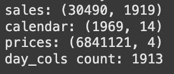
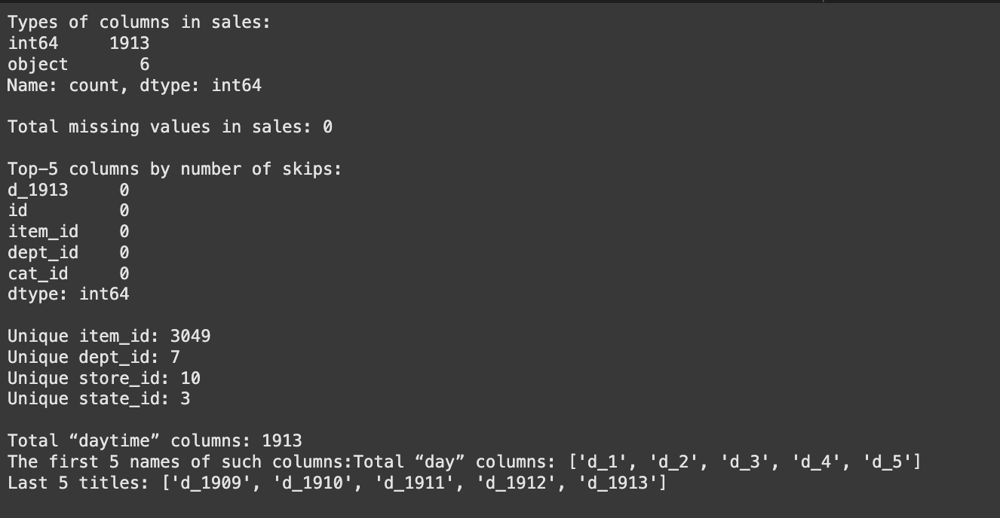
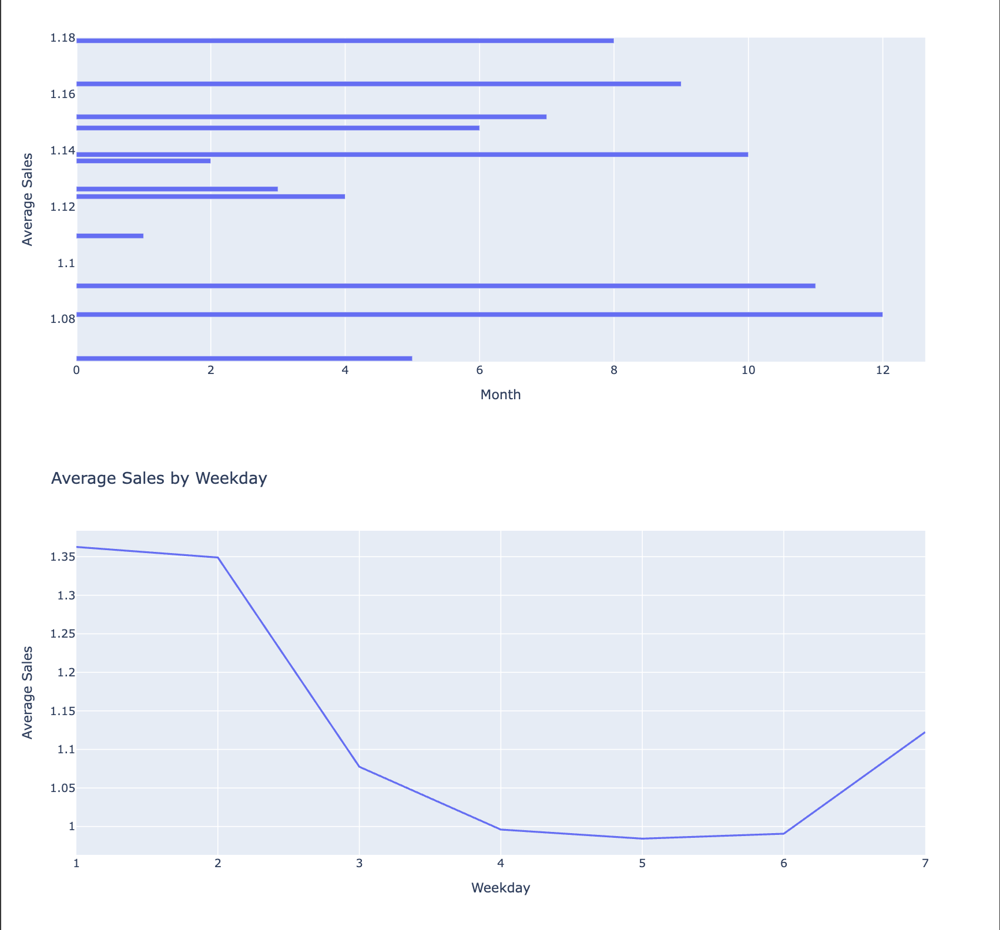
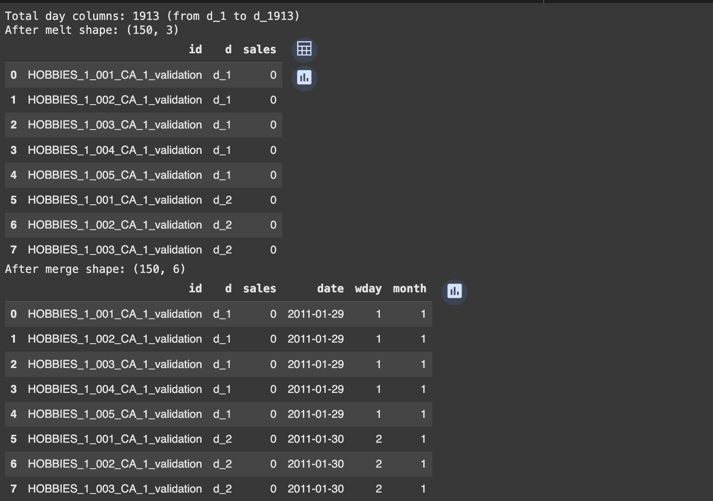
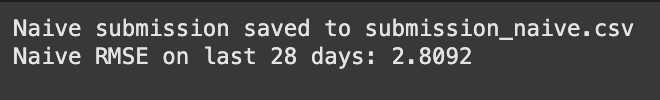
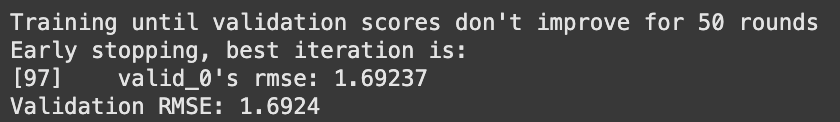

# Demand Forecast (M5 baseline)

Predicting 28-day item-level sales for Walmart using the public **M5 Forecasting – Accuracy** dataset.  
The project walks from raw CSVs to a LightGBM model that beats the naïve “repeat-last” baseline by ~26 % ( **WRMSSE 0.74** ).

---

## Dataset

- **calendar.csv** holiday and date metadata  
- **sales_train_validation.csv / sales_train_evaluation.csv** daily unit sales *d₁ … d₁₉₁₃ / d₁₉₄₁*  
- **sell_prices.csv** item prices by store and week  
- **sample_submission.csv** submission template

---

## Quick data glimpse

---

## Exploratory patterns

Average sales by month and weekday:

---

## Feature engineering

Lag and rolling statistics are built on the melted long-format table.

- lag 1 / lag 7  
- rolling mean 7 / 28  
- calendar features — weekday, month, year

Preview after **melt + calendar join**:

Prepared feature matrix shape:

---

## Baseline metrics

Naïvely repeating the last known sales (d-1913) gives:

  

---

## LightGBM baseline

Parameters  
learning_rate: 0.1
num_leaves: 31
feature_fraction: 0.8
early_stopping: 50

Training log:

Validation result (subset of 2 000 series):

**RMSE 1.69 | WRMSSE 0.74**

---

Next steps:
add price-based features from sell_prices.csv
scale to the full 30 490 series (memory optimisation)
hyper-parameter search with Optuna and MLflow tracking
expose model via FastAPI / Streamlit for real-time inference

Author – Nikita Marshchonok
Kaggle M5 Forecasting – Accuracy | WRMSSE 0.74
